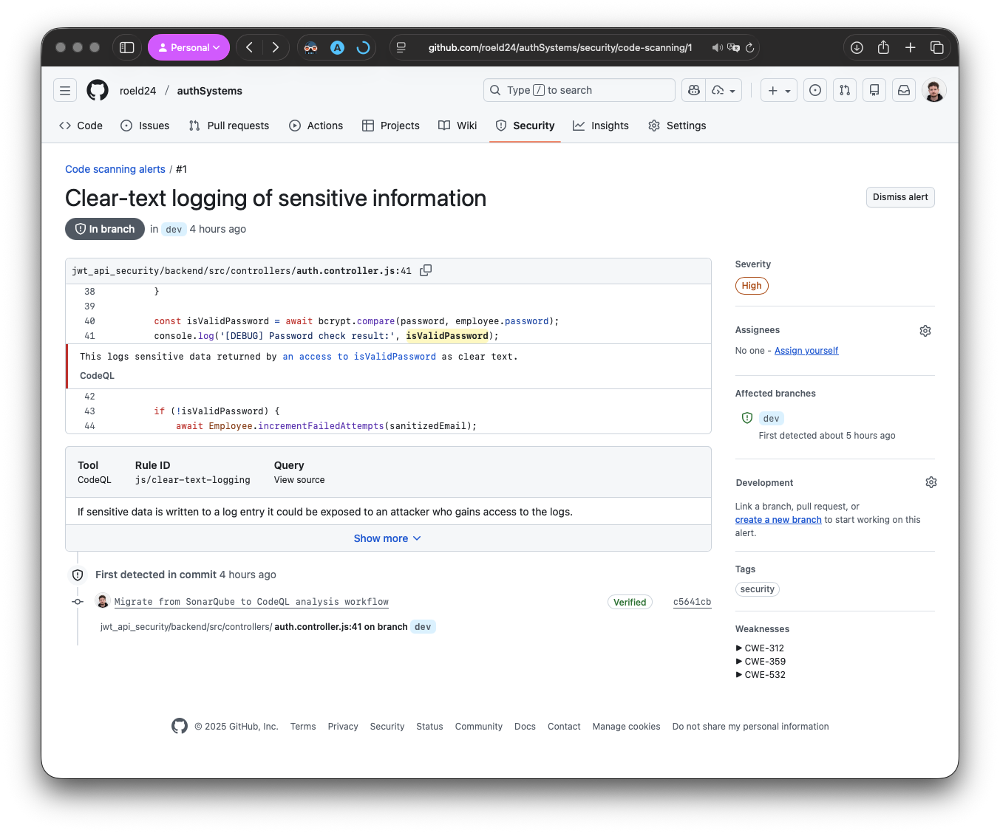
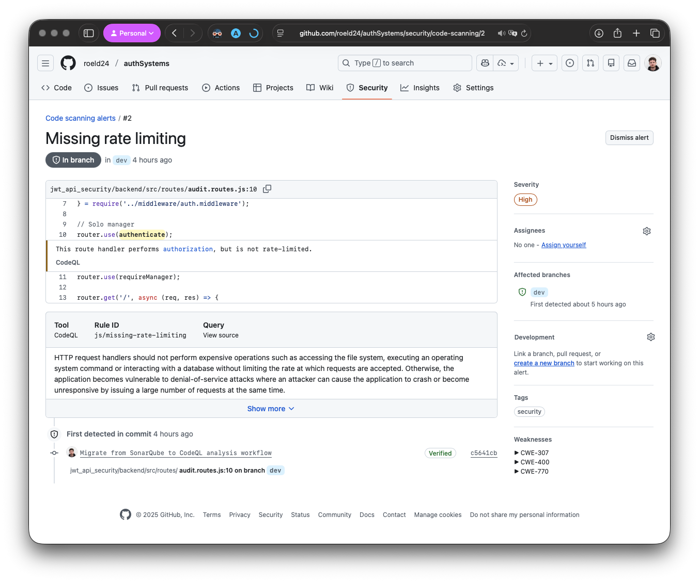
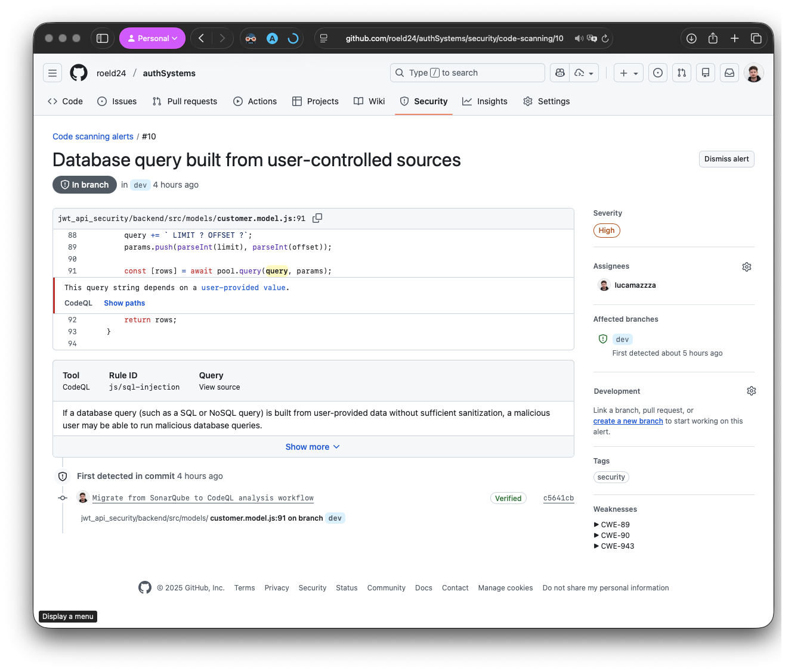
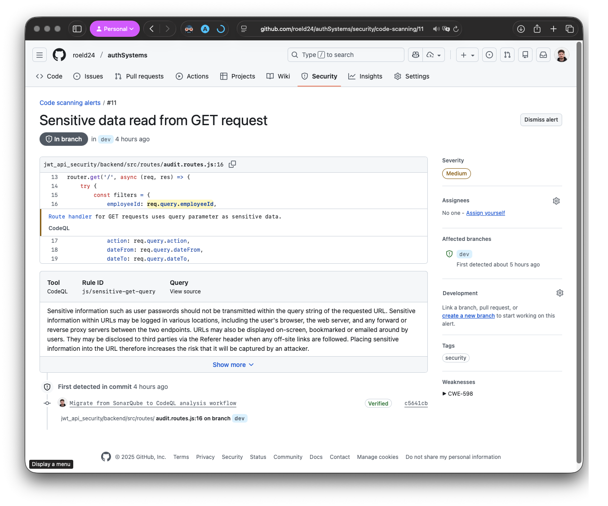

# Code Analysis Report

Durante lo sviluppo, è stata eseguita una scansione generale del codice prodotto 
fin a quel momento, per individuare potenziali problemi di sicurezza, vulnerabilità e
miglioramenti della qualità del codice. La scansione è stata effettuata utilizzando
lo strumento `CodeQL`, integrato in GitHub Actions.

Il risultato della scansione ha evidenziato i seguenti punti:

Il tool in questo caso segnala la presenza di informazioni sensibili all'interno del sistema di log.
Risolto semplicemente rimuovendo le informazioni sensibili dai log di debug.

La seconda segnalazione è invece un po' più complessa, in quanto riguarda la prevenzione di attacchi
`DDoS` (Distributed Denial of Service).
Il problema riguarda l'assenza di un sistema di limitazione delle richieste in ingresso.
Per risolvere questo problema, è stato implementato un sistema di rate limiting utilizzando
la libreria `express-rate-limit`, che consente di limitare il numero di richieste che un utente
può effettuare in un determinato intervallo di tempo.

> *Nota*: erano presenti diverse segnalazioni dello stesso problema per diversi endpoint, tutti 
> riguardanti il rate limiting. La soluzione adottata ha risolto tutte le segnalazioni di questo tipo.

La terza segnalazione riguarda il provvedimento di parametri per una Query SQL, utilizzando direttamente
variabili utente. Questo può portare a vulnerabilità di tipo SQL Injection.

Per risolvere questo problema, sono stati utilizzati i Query Parameters forniti dalla libreria `pg`
che consentono di eseguire query SQL in modo sicuro, evitando il rischio di SQL Injection.

Infine, l'ultima segnalazione riguarda l'utilizzo di dati sensibili all'interno di richieste `GET`.
Le richieste `GET` non sono sicure per trasmettere informazioni sensibili, in quanto i dati
vengono inclusi nell'URL e possono essere facilmente intercettati o memorizzati nei log del server.

# Risk Assessment

* **Criticità Alta**: Gestione dei "Secrets"

La chiave privata usata per firmare i JWT è hardcoded nel file auth.config.js.
Se un attaccante ottiene accesso al codice sorgente (es. tramite un leak su GitHub), può generare token JWT
validi e impersonare qualsiasi utente, inclusi gli admin.

* **Criticità Media**: Logging Eccessivo

Nel file auditLog.model.js e nel middleware, c'è il rischio di loggare dati sensibili.
Se un utente sbaglia il login e inserisce la password nel campo username per errore, e il sistema logga il payload
della richiesta, la password finisce in chiaro nei log.

* **Criticità Bassa**: Privilegi Eccessivi dell'Utente DB

L'applicazione Node.js usa un utente DB con privilegi elevati (es. root).
Se un attaccante sfrutta una vulnerabilità SQL Injection, può compromettere l'intero database
e cancellare o modificare dati critici.

## Miglioramenti

* Gestione dei "Secrets": Spostare la chiave privata fuori dal codice sorgente, usando variabili d'ambiente o un
servizio di gestione dei segreti (es. AWS Secrets Manager, HashiCorp Vault).
* Key Rotation: Implementare un meccanismo che permetta di ruotare le chiavi privata/pubblica senza
interrompere il servizio (es. usando l'header kid - Key ID nel JWT).
* Principio del privilegio minimo: L'utente DB usato dall'applicazione Node.js non deve essere root.
Andrebbe creato un utente specifico che ha permessi solo di SELECT, INSERT, UPDATE sulle tabelle necessarie, e revoca 
DROP o ALTER.
* Redazione dei log: Rivedere quali dati vengono loggati per evitare di includere informazioni sensibili.
* Response plan: Definire uno script che, in caso di sospetto di breach, invalidi tutti i token e forzi il reset della 
password a tutti gli utenti.

# Aspetti relativi alla Privacy

| Categoria                                 | Dati                                                        | Sensibilità                              |
|-------------------------------------------|-------------------------------------------------------------|------------------------------------------|
| PII (Personally Identifiable Information) | `FirstName`, `LastName`, `Address`, `City`, `BirthDate`, ...| Alta: permettono identificazione univoca |
| Dati di contatto                          | `Email`, `PhoneNumber`                                      | Media: vettori per phishing/spam         |
| Dati finanziari                           | `InvoiceDate`, `BillingAddress`, `Total`                    | Alta: rischio frodi e furti d'identità   |
| Dati di autenticazione                    | `Username`, `PasswordHash`, `Salt`                          | Molto alta: accesso non autorizzato      |
| Dati comportamentali                      | Log delle attività                                          | Bassa: profilazione utente               |           

## Classificazione per Necessità di Trattamento

Secondo il principio di Minimizzazione dei Dati (GDPR Art. 5), ogni dato deve essere giustificato da una specifica
finalità.

a. Necessari per l'Esecuzione del Contratto (Operativi)

> FirstName, LastName, Address, BillingAddress, Invoice details.

> Senza questi dati non è possibile generare fatture legali o associare un acquisto a un cliente. Devono essere 
> conservati per obblighi fiscali (solitamente 10 anni).

b. Necessari per l'Autenticazione e Sicurezza (Tecnici)

> Email, Password (Hash), Logs.

> L'email funge da ID univoco. La password serve per l'accesso. I log servono per l'accountability e la forensic 
> analysis in caso di attacco.

> Le password non devono mai essere leggibili (nemmeno dagli amministratori).

c. Dati Facoltativi o a Rischio "Nice-to-have"

> Fax, BirthDate (per gli impiegati), Phone (se non usato per 2FA).

> Spesso questi campi nei database legacy (come Chinook) sono superflui per le app moderne.

> Se non strettamente necessari per il business, questi dati dovrebbero essere eliminati o non raccolti per ridurre la 
> superficie di attacco.

## Vulnerabilità Privacy Identificate

1. **Eccessiva Conservazione dei Dati**: Alcuni dati personali (es. Fax, BirthDate) potrebbero non essere più necessari
   per le operazioni correnti e dovrebbero essere eliminati per ridurre i rischi di violazione della privacy. Una
   soluzione potrebbe essere implementare una politica di retention che preveda la cancellazione automatica dei dati non 
   più necessari dopo un certo periodo di tempo.

2. **Logging di Dati Sensibili**: I log delle attività potrebbero includere informazioni personali che non sono
   necessarie per il monitoraggio delle prestazioni o la sicurezza, esponendo gli utenti a rischi inutili.
   Una soluzione potrebbe essere rivedere e filtrare i dati loggati per escludere informazioni sensibili.

3. **Mancanza di Crittografia per Dati Sensibili**: Alcuni dati personali potrebbero non essere adeguatamente protetti
   come previsto dalle normative sulla privacy, aumentando il rischio di accesso non autorizzato.
   Una soluzione potrebbe essere implementare la crittografia per i dati sensibili sia a riposo che in transito.

