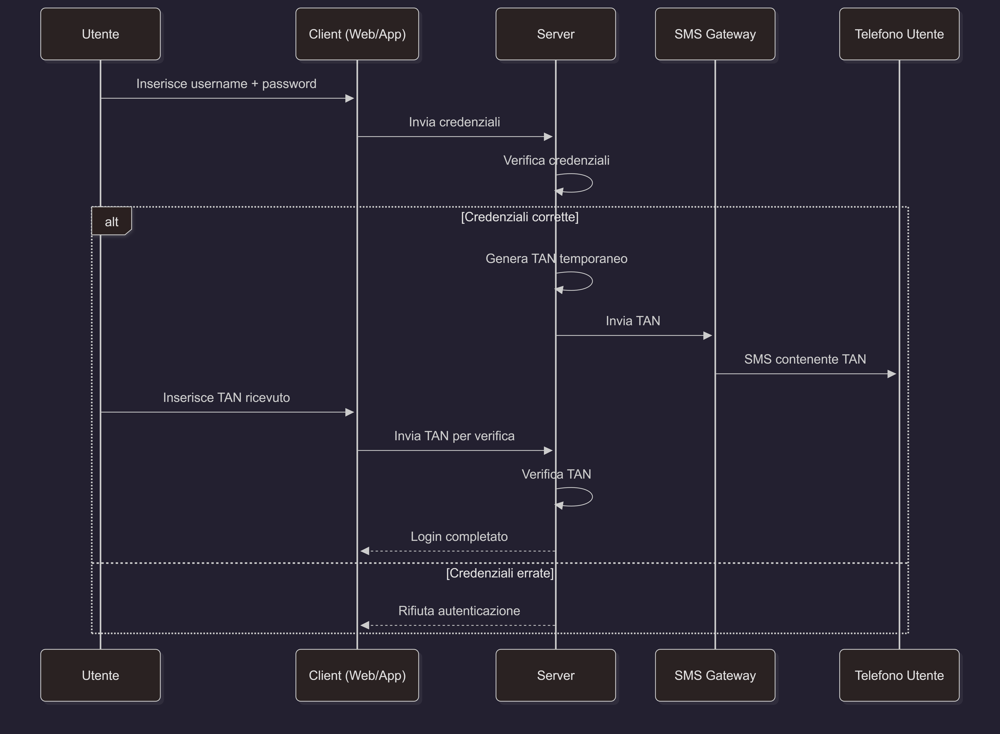
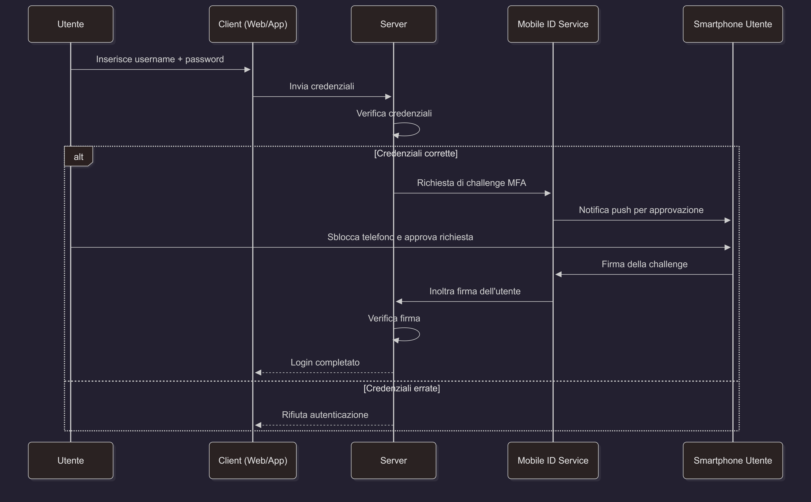
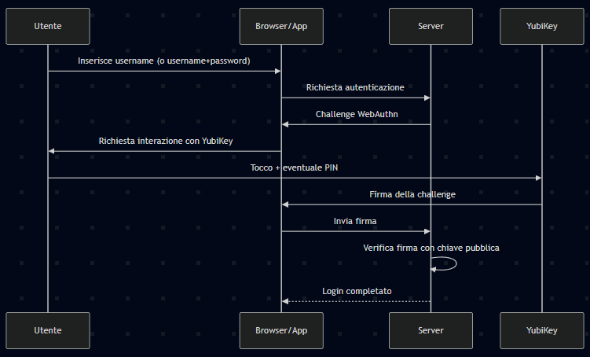

# 0 - REPORT SUL PROGETTO DI SISTEMI DI AUTENTICAZIONE
Oggigiorno la quasi totalità delle soluzioni IT si basano su architetture web.
Nella maggior parte dei casi tali soluzioni prevedono l’autenticazione di utenti su
un Front-End di presentazione che interagisce con un sistema Back-End sul
quale sono memorizzati database e procedure/algoritmi.

Nel corso di questo progetto verranno applicate le tecnologie di autenticazione e
di identificazione in due ambiti:

- un piccolo progetto dimostrativo dei sistemi di autenticazione di utenti a
diversi livelli (password, multi-factor authentication);
- un piccolo progetto che mostri l’applicazione dei sistemi di autenticazione
per rendere sicure le API (Application Programmin Interface).

Particolari aspetti da considerare valutando i rischi delle diverse architetture:
- Quali informazioni vengono utilizate
- Dove vengono salvate queste informazioni (file sul Back-End, file sul Front-End, cookies, tokens, …).
- Quali verifiche vengono effettuate e a quale stadio di autenticazione

Note (TODO):
- Produrre un elenco di tutti i pacchetti software ed ev. librerie utilizzati per il
progetto.
- Documentarsi su eventuali vulnerabilità di tali soluzioni e sugli effetti/impatti che
quete potrebbero comportare.
- Documentarsi sul tipo di licenze legate ai pacchetti identificati e a come siano
regolate le responsabilità nell'uso degli stessi.
- Preparare un Deployment Plan che documenti le istruzioni per preparare una potenziale dimostrazione in laboratorio.
 
# 1 - MULTI-FACTOR AUTHENTICATION
Studiare casi distinti d'applicazione per autenticazione di utenti che fanno uso di multi-factor authentication quali ad esempio:
- architettura PostFinance Mobile ID
- un'architettura che faccia uso di autenticazione mTAN
- un'architettura Photo-TAN
- un'architettura che gaccia uso di biometria per il mobile banking

Descrivere il flusso di informazione di queste architetture nelle fasi di user authentication (non di user registration).

Spiegare vantaggi e svantaggi a livello di costi di implementazione di architetture del genere

## SVOLGIMENTO
Metodi:
- mTAN (SMS-TAN)
- Mobile ID
- FIDO2/WebAuthn con chiave hardware

### mTAN
Il server invia un codice temporaneo via SMS al numero registrato dall'utente

- Vantaggi 
  - L'SMS gateway è relativamente economico (0.50 - 0.70 centesimi a SMS)
  - Non serve sviluppare una app dedicata
  
- Svantaggi
  - Serve un contratto con un provider SMS affifabile
  - Tecnologia a rischio di futura migrazione
  - Problemi di roaming o mancata consegna possono portare a costi operativi di assistenza

### Mobile ID
L'utente conferma il login su uno smartphone registrato usando una app o un elemento SIM-based sicuro

- Vantaggi
  - Ridotti costi di assistenza grazie all'app
  - Servizio centralizzato in grado di gestire migliaia di utenti

- Svantaggi
  - Bisogna interfacciarsi con un provider esterno
  - Possibili costi di licenza per utente
  - Mantenere compatibilita' iOS/Android
  - Manutenzione e aggiornamento dell'app

### FIDO2
Autenticazione a chiave pubblica tramite token hardware

- Vantaggi
  - Non esistono costi relativi a SMS o applicazioni
  - Sicurezza altissima, riduce i costi di incident response
- Svantaggi
  - Un token hardware puo' costare dai 20 ai 60 euro a persona
  - Distribuzione e gestione fisica delle chiavi agli utenti
  - Supporto nel caso di smarrimento o rottura delle chiavi

# 2 - COME RENDERE SICURA UNA API
Comunicazione tra applicazione e infrastrutture eterogenee: come rendere sicura una API. A differenza del punto precedente questa soluzione prevede un progetto pratico di sviluppo di una applicazione delle tecniche da studiare.

Cercare e documentare le principali alternative di autenticazione (JWT, OAUTH, SAML).

## SVOLGIMENTO
### introduzione
Quando una applicazione deve comunicare con infrastrutture eterogenee signidica che parla con sistemi diversi tra loro: server, database ecc...
Per farli dialogare si usano spesso le API, cioe' punti di accesso che permettono a un software di chiedere dati o servizi a un altro software.

Per rendere sicura una API bisogna proteggere sia il canale sia chi ci accede. Si usa una connessione cifrata (HTTPS) per evitare che i dati possano essere letti luno il percorso. Poi si verifica l'identita' di chi chiama l'API tramite chiavi, token o altri meccanismi di autenticazione.

Perchè questa comunicazione avvenga in modo sicuro bisogna quindi che sia cifrata, controllata e limitata.

### JWT
I JSON Web Token sono un modo standard per consegnare a una applicazione un pass digitale che prova identita' e cosa puoi fare. E' composto da tre parti:
- Header: contiene informazioni su che tipo di token è e quale algoritmo è usato per firmarlo
- Payload: contiene le "asserzioni", dati sull'utente o sull'applicazione quindi chi ha emesso il token, per chi è valido, quando scade ecc...
- Signature: è la firma crittografica che impedisce a chiunque di modificare il token senza essere scoperto

Funzionamento

- Vantaggi
  - Leggero
  - Facile da leggere 
  - Supportato globalmente

- Rischi
  - Resta valido finche' non scade (se viene rubato nel periodo di funzionamento puo' essere usato)

### OAuth 2.0
### SAML 2.0

### Fonti
- https://www.kelltontech.com/kellton-tech-blog/api-security-design-patterns

# 4 - OAUTH2
Studiare il framework di autorizzazione OAUTH2 e spiegare le differenze con JWT. 

## SVOLGIMENTO

### Fonti
- https://auth0.com/docs/authorization/protocols/protocol-oauth2
- https://auth0.com/docs/authorization/flows/call-your-api-using-the-authorization-code-flow

# 5 - RISCHI E CONTROMISURE
Per i sistemi JWT usati in questa esercitazione teorica e di laboratorio, quali rischi per la privacy si possono identificare?

Sarebbe possibile implementare una contromisura che garantisca una migliore privacy?

## SVOLGIMENTO
